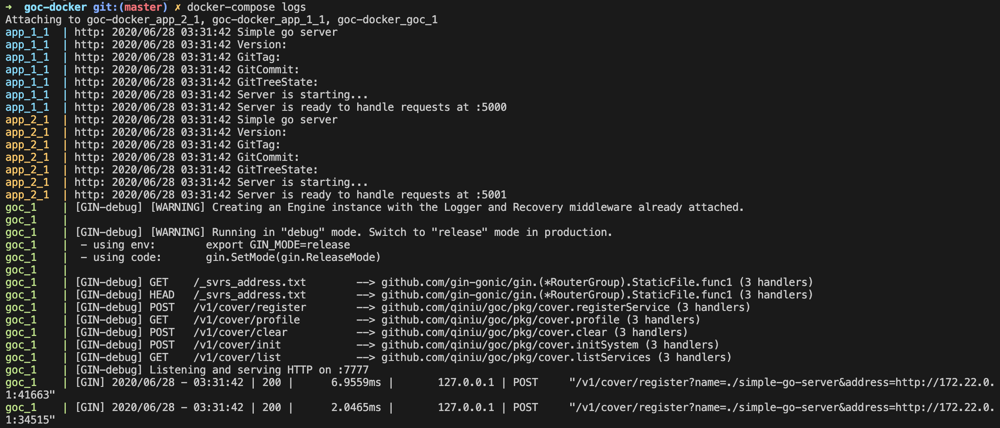

# goc-docker

基于七牛云 goc cli 工具，使用 docker-compose 的方式编排，多个 app 服务共用一个 goc server。

## Usage

```bash
git clone https://github.com/ShaoNianyr/goc-docker
cd goc-docker
docker-compose up -d
docker-compose logs
```

## View



## Contributing

[goc](https://github.com/qiniu/goc)

[simple-go-server](https://github.com/enricofoltran/simple-go-server)